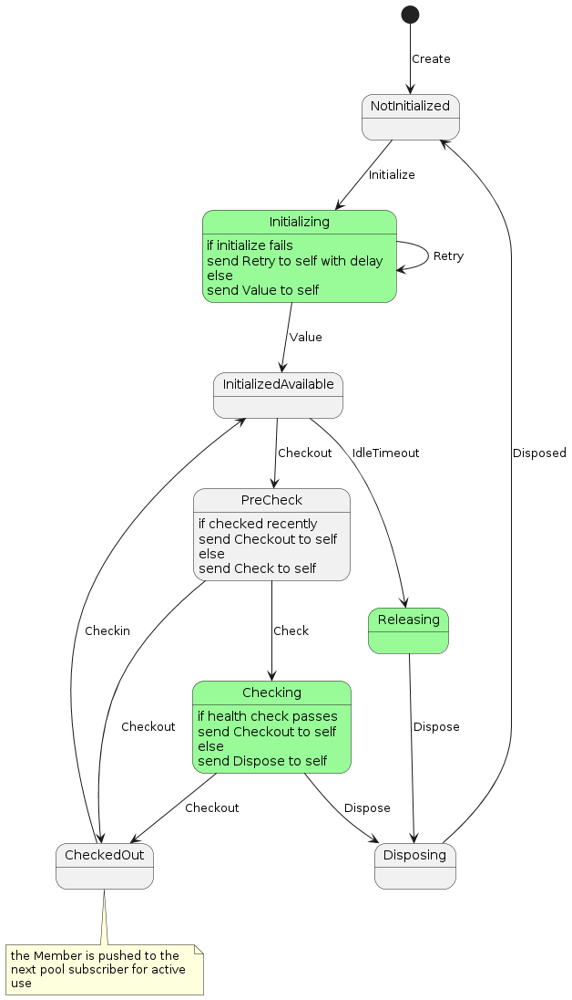

# rxjava3-pool

Reactive object pool for use with RxJava 3.x. A core artifact for [rxjava2-jdbc](https://github.com/davidmoten/rxjava2-jdbc) that has been migrated to RxJava 3.x and given its own source repository.

A pool is initialized with `n` Member objects where `n` is the maximum size of the pool. 

Each Member object is either empty or holds an initialized value (like a database connection for example). 

The state diagram for a Member is below. 

