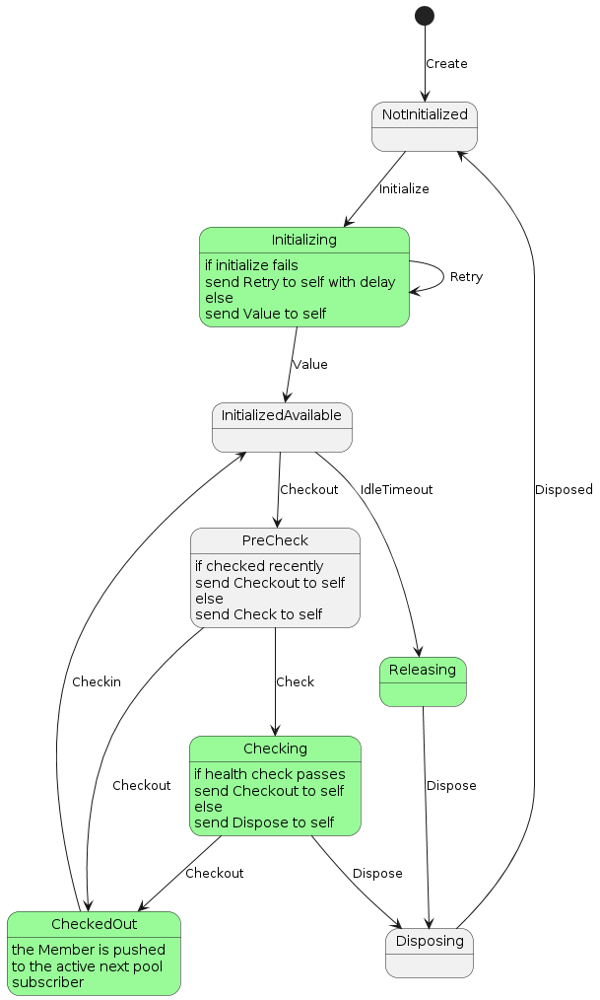

# rxjava3-pool

Reactive object pool for use with RxJava 3.x. A core artifact for [rxjava2-jdbc](https://github.com/davidmoten/rxjava2-jdbc) that has been migrated to RxJava 3.x and given its own source repository.

A pool is initialized with `n` Member objects where `n` is the maximum size of the pool. 

Each Member object is either empty or holds an initialized value (like a database connection for example). 

The state diagram for a Member is below. The states in green have entry procedures that can be run on user-specified schedulers (see example of creating a `NonBlockingPool` below).



A `Pool` conforms to this interface:

```java
public interface Pool<T> extends AutoCloseable {

    Single<Member<T>> member();

}
```

This library provides one implementation of `Pool` being `NonBlockingPool`. Here's an example to create one:

```java
Pool<Connnection> pool = 
  NonBlockingPool
    .factory(() -> DriverManager.getConnection(url))
    .checkinDecorator(checkInDecorator)
    .idleTimeBeforeHealthCheck(30, TimeUnit.SECONDS)
    .maxIdleTime(300, TimeUnit.SECONDS) 
    .createRetryInterval(10, TimeUnit.SECONDS)
    .scheduler(Schedulers.io())
    .disposer(c -> {try { c.close();} catch (Throwable e) {log.warn(e.getMessage(),e);}})
    .healthCheck(c -> true)
    .scheduler(Schedulers.io())
    .maxSize(10)
    .build();
```

The `Single<Member>` returned by `Pool.member()` can be subscribed to as many times as you like, concurrently if desired. The subscriber will be emitted to with a `Member` that has a value and when the subscriber has finished should call `Member.checkin()` to return the item to the pool.

Note that the *release* (*dispose*) action should not throw, nor should the *checker* action. The *initializing* action may throw and if it does will be subject to retries on user-specified interval.
